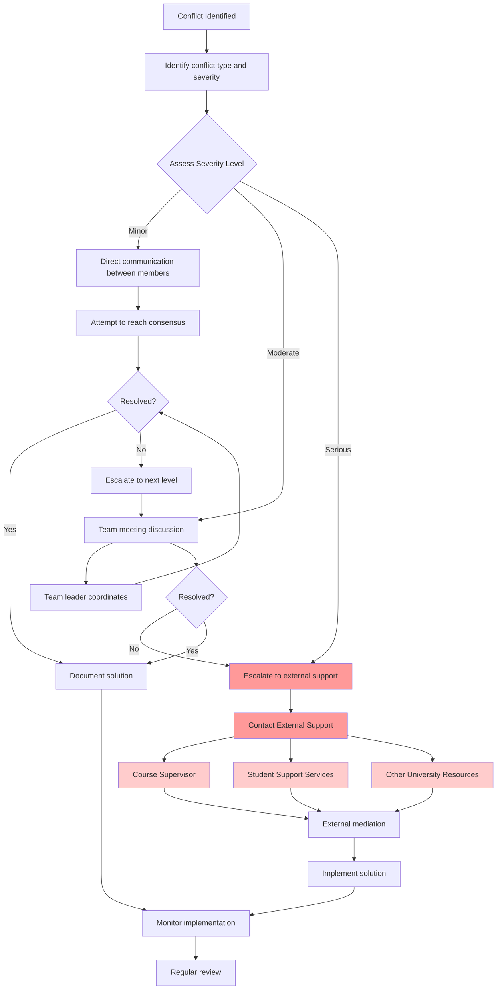

# Workplace Charter draft

generally limited to three pages in length

**Page 1&2**

---
## statement of purpose (5%)
"The purpose of this activity is to develop a workplace charter which describes how the team will operate and act as a reference point for any conflict management"

This workplace charter will be used as a guide for regulating the team's behavior and decision-making, and to help resolve any conflicts that may arise. It will also be used to make sure that everyone is productivly working towards the same goals.

## statements of Principles and Commitments (10%)

some example statemens:

### As a team we will:

- Pationate to be successful in both technical design and collaborative process
- make good use of the strenth of each member based on the differnent education background and experiences
- using all the resourse we have to try our best to allow the robot to automatically navigate through the maze and able to recongnize and pick up the objects, and any other tasks that are assigned to the team.
- Support each other's learning and professional development
- Hold ourselves accountable to our commitments and deadlines
- Prioritize the team's success over individual recognition
 
- Ensure all design decisions consider safety, reliability, and performance requirements
- Document our work thoroughly for future teams and assessment
- Follow engineering best practices and standards
- Balance innovation with practical constraints (time, budget, feasibility)

### as a team member I will:

**Communication & Collaboration:**
- Actively participate in team meetings and discussions
- Respond to team communications within 9am-9pm (or communicate if unavailable)
- Share my ideas, concerns, and questions openly and respectfully
- Listen actively to others' viewpoints before responding
- Provide constructive feedback focused on ideas

**Work Quality:**
- Complete my assigned tasks by agreed deadlines or communicate early if delays occur
- Deliver work that meets our team's quality standards
- Take responsibility of my mistakes and try to learn from them
- Ask for help when I need it, rather than struggling in silence
- Be honest about my workload and capacity

**Respect & Professionalism:**
- Arrive on time and prepared for meetings and lab sessions
- Approach the problems with different perspectives
- Address conflicts directly and professionally with the person involved
- Maintain confidentiality about team discussions and personal information

**Continuous Improvement:**
- Seek and act on feedback to improve my contributions
- Share knowledge and skills with team members
- Be open to learning new tools, methods, and approaches
- Reflect on team processes and suggest improvements

### Our Core Values:

1. **Integrity** - We are honest, transparent, and accountable in all our actions
2. **Respect** - We value each person's contributions, time, and wellbeing
3. **Excellence** - We pursue high standards in technical work and teamwork
4. **Collaboration** - We achieve more together than individually
5. **Growth** - We see challenges as opportunities to learn and improve

## Team Rules (35%)

### 1. Lab Attendance and Participation

**Lab Sessions:**
- Attendance at all scheduled lab sessions is mandatory
- Arrive at least 15 minutes early to collect the equipments and set up the workspace
- Come prepared with pre-lab work completed(mechanical design and software control)
- If unable to attend, notify team leader at least 24 hours in advance
- work only on the project during the lab sessions

### 2. Communication Standards

**Response Times:**
- Urgent messages (marked as urgent): Within 2 hours
- General messages: Within 24 hours (9am-9pm)
- Non-urgent weekend messages: By Monday 10am

**Communication Channels:**
- **WhatsApp group**: Day-to-day coordination, quick questions, scheduling
- **Email**: Formal communications with supervisor, official documents
- **GitHub**: Code, documentation, technical files, version control

### 3. Work Allocation and Task Management

**Task Assignment:**
- Tasks assigned based on skills, workload balance, and learning opportunities
- All tasks recorded in shared task tracker (weekly logbook)
- Each task must have: assigned person, deadline, and acceptance criteria

**Deadlines:**
- Internal deadlines set 48 hours before external deadlines
- Progress updates required at 25%, 50%, and 75% completion
- If unable to meet deadline, notify team at least 48 hours in advance

### 4. Decision-Making Process

**Minor Decisions** (tool choices, formatting, scheduling):
- Decided by relevant sub-team or assigned member
- Inform full team via communication channel

**Major Decisions** (design choices, strategy, major purchases):
- Discussed in team meeting
- Consensus preferred; if not possible, majority vote (minimum 75% present)
- All decisions documented with rationale

### 5. Quality Standards and Documentation

**Code and Design Standards:**
- Follow agreed coding style guide (e.g., PEP 8 for Python)
- All code must be commented and include README
- Peer review required before merging to main branch
- Test code before submitting

**Documentation Requirements:**
- Weekly individual log entries (what done, time spent, challenges, next steps)
- All design decisions documented with rationale
- CAD files organized with clear naming conventions

**Version Control:**
- Commit messages must be descriptive
- Pull requests require at least one approval

### 6. Resource Management

**Shared Resources:**
- Return borrowed items within agreed timeframe
- Report damaged or missing items immediately

### 7. Health, Safety, and Wellbeing

**Lab Safety:**
- Report all incidents immediately
- No work alone in lab without supervisor approval

**Wellbeing:**
- Respect work-life balance; no expectation to work late nights
- Support team members facing personal difficulties
- Take breaks during long work sessions

### 8. Language and Working Hours

**Language:**
- All team communications, documentation, and meetings in English
- Support non-native speakers; encourage questions if unclear

**Working Hours:**
- Core collaboration hours: [e.g., Monday-Friday 10am-4pm]
- Individual work can be done anytime
- No expectation to respond to messages outside 9am-9pm
- Respect weekends unless agreed emergency

## Daily Activity Conflict Avoidance (15%)

example:
- keep a efficient communication and discussion during the lab sessions 
- update the progress of each member's work daily. (or keeping a weekly logbook for each member) make sure everyone is aware of the progress of each member's work.

**Page 3**

---

## Conflict Resolution Flowchart (35%)

example:

