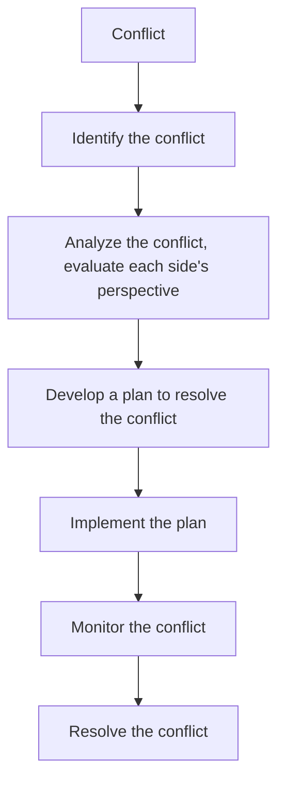

# Workplace Charter draft

generally limited to three pages in length

**Page 1&2**

---
## statement of purpose (5%)
"The purpose of this activity is to develop a workplace charter which describes how the team will operate and act as a reference point for any conflict management"

This workplace charter will be used as a guide for regulating the team's behavior and decision-making, and to help resolve any conflicts that may arise. It will also be used to make sure that everyone is productivly working towards the same goals.

## statements of Principles and Commitments (10%)

some example statemens:

**As a team we will:**

- try our best to achieve the goals of the project
- make full use of this team work experience for future career development

**as a team member I will:**
- contribute to the team's success
- communicate effectively with the team
- be respectful and considerate of the team's goals
- be flexible and adaptable to the team's needs
- be proactive in resolving conflicts
- be committed to the team's success
- be honest and transparent in communication
- be willing to learn and grow
- be willing to help the team
- be willing to accept feedback and criticism
- be willing to take responsibility for one's actions
- be willing to be flexible and adaptable to the team's needs

## Team Rules (35%)

example: 
Working hours except the lab sessions: at least 2 hours of preperation for the lab sessions before each lab session.
Language: English
Communication method(discussion): WhatsApp
Communication method(documentation): GitHub

## Daily Activity Conflict Avoidance (15%)

example:
- keep a efficient communication and discussion during the lab sessions 
- update the progress of each member's work daily. (or keeping a weekly logbook for each member) make sure everyone is aware of the progress of each member's work.

**Page 3**

---

## Conflict Resolution Flowchart (35%)

example:

