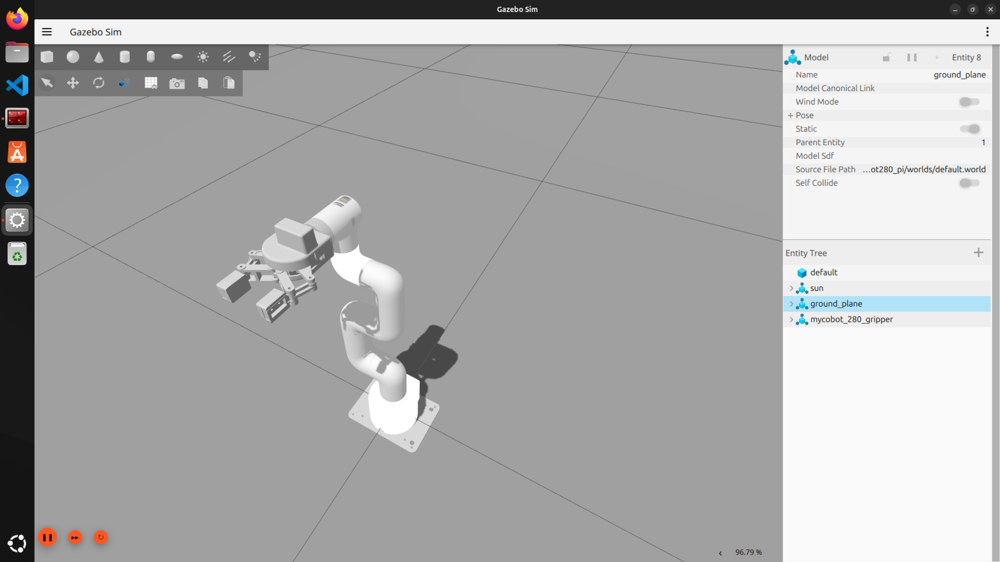
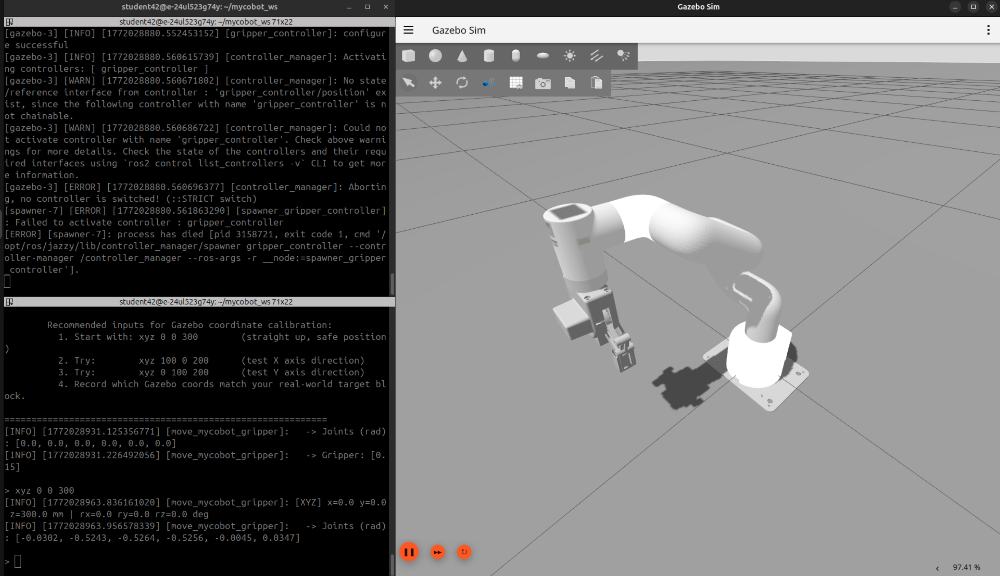

# MyCobot 280 Pi Manipulator Control Package

**This package is still in development.**
ROS2 control package used for Elephant Robotics MyCobot 280pi Manipulator. Supports RViz visualization, Gazebo simulation and real hardware control.

## Features

- Supports MyCobot 280 Pi Manipulator (with Adaptive Gripper)
- RViz visualization simulation
- Gazebo physics simulation (with and without gripper)
- Pick and Place demonstration
- Mock mode local testing (no hardware required)
- ROS 2 distributed control (supports WiFi communication)
- Compatible with pymycobot API

## File Structure

```
scripts   -- Inculuding some calibration tools for arm and gripper 
my_cobot_control    -- Manipulator Control Package (URDF, TF2, Controllers, Pick-and-Place Logic)
mycobot280_pi       -- Gazebo Simulation Package (from mltejas88/Project_Mycobot_280pi_simulation)
```

## System Requirements

- **Operating System**: Ubuntu 22.04 / 24.04
- **ROS 2**: Jazzy (or Humble)
- **Python**: 3.12+
- **Dependencies**:
  - `pymycobot` (hardware control & inverse kinematics from Elephant Robotics)
  - `mycobot_ros2` (official URDF model and ROS 2 integration from Elephant Robotics)
  - `gazebo` / `gz-sim` (Gazebo simulation)
  - `ros-$ROS_DISTRO-gazebo-ros-pkgs` (Gazebo ROS bridge)
  - `ros-$ROS_DISTRO-joint-state-publisher`
  - `ros-$ROS_DISTRO-robot-state-publisher`
  - `ros-$ROS_DISTRO-controller-manager`
  - `ros-$ROS_DISTRO-ros2-control`
  - `ros-$ROS_DISTRO-ros2-controllers`

## Installation Steps

### 1. Create Workspace

```bash
mkdir -p ~/mycobot_ws/src
cd ~/mycobot_ws/src
```

### 2. Clone Repository

```bash
# Clone this package
git clone https://github.com/DissimilarTriangle/MyCobot280Pi_ROS2_Package

# Clone the official mycobot_ros2 package (provides URDF model)
# The official repository only supports Humble, but you can try to use it in Jazzy as well.
git clone -b humble https://github.com/elephantrobotics/mycobot_ros2.git

# The Gazebo simulation package (already included in this repo)
# Source: https://github.com/mltejas88/Project_Mycobot_280pi_simulation
```

### 3. Build Workspace

```bash
# (Optional) Create a Python virtual environment for pymycobot
cd ~/mycobot_ws
python3 -m venv venv_mycobot
source venv_mycobot/bin/activate

# Install PyMyCobot API (for hardware control & IK)
pip install pymycobot

# If you want to install from source:
# git clone https://github.com/elephantrobotics/pymycobot.git
# pip install ./pymycobot
```

> **Note:** Sometimes the virtual environment is required to avoid conflicts between `pymycobot` and ROS 2 Python dependencies.

### 4. Build ROS 2 Packages

```bash
cd ~/mycobot_ws
colcon build --packages-select mycobot280_pi mycobot_description
# Or build all packages
colcon build --symlink-install
source install/setup.bash
```

---

## Usage

### 1. Run RViz Simulation

```bash
source ~/mycobot_ws/install/setup.bash
ros2 launch my_cobot_control pick_and_place_demo.launch.py
```

This will:
1. Launch RViz to display the MyCobot 280 model (with Adaptive Gripper)
2. Loop pick and place presentation

This part is abandoned for now, as we are focusing on Gazebo simulation and real hardware control. The RViz launch file is still available for testing the TF2 setup and joint state publishers without Gazebo or hardware.

---

### 2. Run Gazebo Simulation

#### 2.1 Without Gripper

```bash
# Terminal 1 — Start Gazebo simulation
ros2 launch mycobot280_pi mycobot.launch.py

# Terminal 2 — Run control script
ros2 run mycobot280_pi move_mycobot.py
```

#### 2.2 With Gripper

```bash
# Start Gazebo simulation with gripper
ros2 launch mycobot280_pi mycobot_gripper.launch.py
```

You should see the gripper in Gazebo like this:



Run the gripper control script:

**Interactive mode (default)** — used for Gazebo coordinate calibration:
```bash
ros2 run mycobot280_pi move_mycobot_gripper.py
```



**Automatic task mode:**
```bash
ros2 run mycobot280_pi move_mycobot_gripper.py --auto
```

**Kill all Gazebo processes (clean exit):**
```bash
killall -9 ruby gz
```

---

# 3 Hardware Controller Test (Real Arm)

## 3.1 Architecture Overview

`mycobot_controller` node runs under the `/arm` namespace and controls the MyCobot 280 Pi + adaptive gripper via `pymycobot`. It implements a **split pick/place** workflow:

- **PICK phase**: receive 3D pick coordinates → grab block → verify grip → return to home → enter **HOLDING** state
- **HOLDING**: arm locked at home with block held; rover can move freely to find the target bin
- **PLACE phase**: receive 3D bin coordinates → move above bin → release (drop) → return to home → back to **IDLE**

### ROS 2 Topics (under `/arm` namespace)

| Topic | Type | Direction | Description |
|---|---|---|---|
| `target_pick` | `geometry_msgs/Point` | Subscribe | 3D pick coordinates (triggers pick phase, only accepted in IDLE) |
| `target_place` | `geometry_msgs/Point` | Subscribe | 3D bin coordinates (triggers place phase, only accepted in HOLDING) |
| `status` | `std_msgs/String` | Publish | Current state: `idle`, `holding`, `moving_to_pick`, `releasing`, etc. |
| `gripper_status` | `std_msgs/String` | Publish | Grip feedback: `object_held`, `no_object`, `released`, `object_dropped` |
| `joint_states` | `sensor_msgs/JointState` | Publish | Real-time joint angles at 10 Hz |

### Launch Parameters

| Parameter | Default | Description |
|---|---|---|
| `safe_z` | `220.0` | Safe travel height in mm |
| `move_speed` | `50` | Arm movement speed (1–100) |
| `gripper_speed` | `80` | Gripper speed (1–100) |
| `rviz` | `false` | Launch RViz2 for visualisation |

### NUC Integration Pattern

```
NUC                                           Pi (arm)
 │                                              │
 │── pub /arm/target_pick {x,y,z} ───────────► │  PICK phase starts
 │                                              │
 │◄── sub /arm/status == "holding" ────────────│  Block secured, arm at home
 │                                              │
 │  (rover drives to find matching bin)         │  (arm locked, waiting)
 │                                              │
 │── pub /arm/target_place {x,y,z} ──────────► │  PLACE phase starts
 │                                              │
 │◄── sub /arm/status == "idle" ───────────────│  Done, ready for next block
```

```
TF2 Frame Hierarchy:
base_link
  └── arm_base_link
        └── joint6_flange
              └── gripper_tip
```

## 3.2 Run on Pi (Real Hardware)

### Deploy to Pi
```bash
# From NUC, copy the source to Pi
scp -r ~/mycobot_ws/src/my_cobot_control elephant@10.0.1.3:~/ros2_ws/src/

# SSH into Pi
ssh elephant@10.0.1.3
# password: trunk

# syc time
sudo date -s "$(ssh leo-rover-12@10.0.1.4 'date -u +%Y-%m-%d\ %H:%M:%S.%N')"
sudo date -s "$(ssh student42@10.0.1.4 'date -u +%Y-%m-%d\ %H:%M:%S.%N')"
# check NTP status for timesync
sudo systemctl status ntp
# check hardware clock
timedatectl  

# netplan
sudo nano /etc/netplan/99-wired-static.yaml
sudo netplan apply

# Build on Pi
cd ~/ros2_ws
colcon build --packages-select my_cobot_control
source install/setup.bash
```

### Launch the arm controller
```bash
# On Pi — start the controller (all nodes under /arm namespace)
ros2 launch my_cobot_control mycobot_with_tf2.launch.py

# With custom parameters
ros2 launch my_cobot_control mycobot_with_tf2.launch.py use_mock:=false safe_z:=250.0 move_speed:=40
```

### Or run the node directly (without launch file)
```bash
ros2 run my_cobot_control mycobot_controller --ros-args -r __ns:=/arm
```

## 3.3 Run on Dev Machine (Mock Mode / Development)

When no hardware is connected (no `/dev/ttyAMA0`), the controller automatically enters **MOCK mode** — all hardware calls are simulated with print outputs.

```bash
# On dev machine
cd ~/mycobot_ws
colcon build --packages-select my_cobot_control
source install/setup.bash

# Default: real hardware + base_link->g_base
ros2 launch my_cobot_control mycobot_with_tf2.launch.py

# Mock mode (no hardware, with GUI for joint angles)
ros2 launch my_cobot_control mycobot_with_tf2.launch.py use_mock:=true

# Mock mode with camera_link
ros2 launch my_cobot_control mycobot_with_tf2.launch.py use_mock:=true use_camera_link:=true

# With RViz visualization (optional, requires TF2 setup)
ros2 launch my_cobot_control mycobot_with_rviz.launch.py
```

## 3.4 Test Commands

All test commands below should be run from a **separate terminal** on the NUC (or any machine on the same ROS_DOMAIN_ID).

### Monitor arm status (run first, keep open)
```bash
# Watch real-time state changes
ros2 topic echo /arm/status

# Watch gripper feedback
ros2 topic echo /arm/gripper_status
```

### Test 1: Full pick-and-place cycle
```bash
# Step 1: Send pick coordinates (example block location) 
ros2 topic pub --once /arm/target_pick geometry_msgs/msg/Point "{x: 202.2, y: -129.3, z: 237.9}"

# Wait for status == "holding" (arm has block, at home position)
# The rover would drive to the bin during this time

# Step 2: Send place coordinates (bin location)
ros2 topic pub --once /arm/target_place geometry_msgs/msg/Point "{x: 66.7, y: -218.2, z: 123.7}"
# Wait for status == "idle" (cycle complete)

```

### Test 2: Pick only (verify HOLDING state)
```bash
# Send pick command
ros2 topic pub --once /arm/target_pick geometry_msgs/msg/Point "{x: 202.2, y: -129.3, z: 237.9}"

# Verify arm enters HOLDING state
ros2 topic echo /arm/status --once
# Expected output: data: "holding"

# Verify grip feedback
ros2 topic echo /arm/gripper_status --once
# Expected output: data: "object_held"
```

### Test 3: Rejected commands (state guard)
```bash
# Try to place when not holding — should be rejected
ros2 topic pub --once /arm/target_place geometry_msgs/Point "{x: 23.8, y: -245.6, z: 102.0}"
# Log: "Ignoring target_place (state=IDLE, need HOLDING)"

# Try to pick when already picking — should be rejected
ros2 topic pub --once /arm/target_pick geometry_msgs/Point "{x: 162.5, y: -134.8, z: 87.6}"
# (send twice quickly, second one rejected)
```

### Test 4: Out-of-range coordinate validation
```bash
# Send coordinates outside workspace limits
ros2 topic pub --once /arm/target_pick geometry_msgs/Point "{x: 999.0, y: 0.0, z: 100.0}"
# Log: "Coordinate x=999.0 out of range [-281.45, 281.45]"
```

### Test 5: Monitor joint states
```bash
# View real-time joint positions (10 Hz)
ros2 topic echo /arm/joint_states

# Check topic frequency
ros2 topic hz /arm/joint_states
```

### Test 6: List all arm topics
```bash
ros2 topic list | grep arm
# Expected:
#   /arm/gripper_status
#   /arm/joint_states
#   /arm/status
#   /arm/target_pick
#   /arm/target_place
```

### Test 7: TF2 Transform Validation
```bash
# Check TF2 tree structure
cd ~/mycobot_ws  #or cd ~/ros2_ws
ros2 run tf2_tools view_frames
evince frames.pdf

# Run the TF2 transform test script (requires camera TF setup)
cd ~/ros2_ws/scripts
python3 scripts/test_tf2_transform.py

# Visualize in RViz (optional, requires rviz launch)
ros2 launch my_cobot_control mycobot_with_rviz.launch.py
```

## 3.6 Standalone Calibration Test (No ROS 2)

A standalone script is available for testing pick-and-place with calibrated coordinates directly on the Pi, **without ROS 2**:

```bash
# Run directly with Python (requires pymycobot)
cd ~/ros2_ws/scripts
python3 test_calibration_pick_place.py
```

This script uses hardcoded calibration data (home/pickup/place) and runs a full cycle for hardware validation.

## 3.7 Calibration

Use the calibration tool to record new home/pickup/place positions by dragging the arm manually:

```bash
# On Pi
cd ~/ros2_ws/scripts
python3 calibration_tool.py
```

Calibration files are saved to `my_cobot_control/calibration_data/` and automatically loaded by the controller (latest file used). You can also specify a calibration file explicitly via launch parameter:

```bash
ros2 run my_cobot_control mycobot_controller --ros-args \
  -r __ns:=/arm \
  -p calibration_file:=/path/to/calibration_2026-02-25_18-26-52.json
```

## 3.8 Troubleshooting

| Problem | Cause | Fix |
|---|---|---|
| `No hardware -- running in MOCK mode` | No `/dev/ttyAMA0` found | Run on Pi, or use mock mode for dev |
| `Ignoring target_place (need HOLDING)` | Place sent before pick completed | Wait for `status == "holding"` first |
| `Grip failed -- aborting pick` | Object not detected by gripper | Check gripper torque, object size, pick height |
| `Object lost during lift` | Grip too weak or object slipped | Increase `gripper_torque` parameter (up to 980) |
| `Coordinate x=... out of range` | Target outside workspace | Check coordinate frame, values must be in mm |
| Build error: `shebang too long` | venv path hardcoded on Pi | `setup.py` auto-detects venv; rebuild |
|Timesync issue (hardware clock drift) | Arm movements erratic | Sync Pi clock with NUC: `ssh elephant@10.0.1.4 "sudo date -s '$(date -u +%m%d%H%M%Y.%S)'"`|
---

## 4. ROS2 Communication Interface Reference

> This section lists all ROS2 interfaces exposed by the `mycobot_controller_tf2` node, for NUC-side integration.

### 4.1 Node Info

| Item | Value |
|---|---|
| Node name | `mycobot_controller` |
| Namespace | `/arm` |
| Executable | `mycobot_controller_tf2` |
| Package | `my_cobot_control` |

---

### 4.2 Subscribed Topics (NUC → Arm)

| Full Topic | Message Type | Frame | Description |
|---|---|---|---|
| `/arm/target_pick` | `geometry_msgs/msg/Point` | `base_link` | 3D pick coords (mm). Only accepted in `IDLE` state. Triggers full pick sequence. |
| `/arm/target_place` | `geometry_msgs/msg/Point` | `base_link` | 3D place coords (mm). Only accepted in `HOLDING` state. Triggers place + return. |

**Message field layout (`geometry_msgs/msg/Point`):**

```yaml
x: float64   # X coordinate (mm) in base_link frame
y: float64   # Y coordinate (mm) in base_link frame
z: float64   # Z coordinate (mm) in base_link frame
```

**Coordinate Limits (arm base frame, after TF2 transform):**

| Axis | Min (mm) | Max (mm) |
|---|---|---|
| x | -281.45 | 281.45 |
| y | -281.45 | 281.45 |
| z | -70.0 | 450.0 |

---

### 4.3 Published Topics (Arm → NUC)

| Full Topic | Message Type | Rate | Description |
|---|---|---|---|
| `/arm/status` | `std_msgs/msg/String` | On state change | Current arm state (see state list below) |
| `/arm/gripper_status` | `std_msgs/msg/String` | On grip event | Gripper feedback (see gripper states below) |
| `/arm/joint_states` | `sensor_msgs/msg/JointState` | 10 Hz | Real-time joint angles (radians) |

**`/arm/status` possible values:**

| Value | Meaning |
|---|---|
| `idle` | Ready to accept new pick command |
| `moving_to_pick` | Moving above pick target |
| `descending_pick` | Descending to pick height |
| `gripping` | Closing gripper |
| `grip_check` | Verifying grip |
| `lifting` | Lifting object to safe height |
| `returning_home` | Moving back to home angles |
| `holding` | Block secured, arm locked at home. Ready to accept place command |
| `moving_to_place` | Moving above bin |
| `releasing` | Opening gripper to drop block |
| `error` | Error occurred, check logs |

**`/arm/gripper_status` possible values:**

| Value | Meaning |
|---|---|
| `object_held` | Grip confirmed, object in gripper |
| `no_object` | Grip attempt failed, nothing detected |
| `released` | Gripper opened (after place) |
| `object_dropped` | Object lost during lift or transit |
| `unknown` | Gripper value unreadable |

**`/arm/joint_states` field layout (`sensor_msgs/msg/JointState`):**

```yaml
header:
  stamp: <timestamp>
name: [
  'joint2_to_joint1',
  'joint3_to_joint2',
  'joint4_to_joint3',
  'joint5_to_joint4',
  'joint6_to_joint5',
  'joint6output_to_joint6'
]
position: [j1, j2, j3, j4, j5, j6]   # radians
```

---

### 4.4 TF2 Frames

| Frame | Parent | Source | Description |
|---|---|---|---|
| `base_link` | — | NUC / Camera node | Camera optical origin. Input coords are in this frame |
| `g_base` | `base_link` | Static TF (launch file) | Arm base (`arm_base_link` in URDF). Fixed offset from base_link (rover) |
| `joint6_flange` | `g_base` | `robot_state_publisher` | End-effector flange |
| `gripper_tip` | `joint6_flange` | Static TF (launch file) | Gripper finger tip. Z offset = 79 mm |

Default static transform (`base_link` → `g_base`):

| Param | Default | Description |
|---|---|---|
| `camera_x` | `0.0379` m | X offset |
| `camera_y` | `0.0641` m | Y offset |
| `camera_z` | `-0.0486` m | Z offset |
| `camera_pitch` | `-0.5236` rad | Pitch (-30°) |

---

### 4.5 Launch Parameters

| Parameter | Type | Default | Description |
|---|---|---|---|
| `safe_z` | float | `250.0` | Safe travel height (mm) |
| `move_speed` | int | `40` | Arm speed (1–100) |
| `gripper_speed` | int | `80` | Gripper speed (1–100) |
| `gripper_torque` | int | `300` | Gripper holding torque (1–980) |
| `grip_threshold` | int | `25` | Min gripper value to confirm grip |
| `grip_check_retries` | int | `2` | Number of grip check retries |
| `end_rx` | float | `-178.0` | End-effector roll (deg) |
| `end_ry` | float | `0.0` | End-effector pitch (deg) |
| `end_rz` | float | `0.0` | End-effector yaw (deg) |
| `home_angles` | float[] | `[0,0,0,0,0,0]` | Home joint angles (deg) |
| `calibration_file` | string | `''` | Path to calibration JSON |
| `camera_frame` | string | `camera_link` | TF2 source frame for input coords |
| `arm_base_frame` | string | `g_base` | TF2 arm base frame |
| `tf_timeout` | float | `1.0` | TF2 lookup timeout (s) |
| `compensate_gripper_offset` | bool | `true` | Auto subtract gripper Z offset |
| `gripper_offset_z` | float | `79.0` | Fallback gripper Z offset (mm) |
| `use_mock` | bool | `true` | Launch joint GUI (dev) or real hw |

---

### 4.6 NUC-Side Quick Reference (Python)

Minimal ROS2 publisher example for pick-and-place from NUC:

```python
import rclpy
from rclpy.node import Node
from geometry_msgs.msg import Point
from std_msgs.msg import String

class NucArmClient(Node):
    def __init__(self):
        super().__init__('nuc_arm_client')

        self.pick_pub = self.create_publisher(Point, '/arm/target_pick', 10)
        self.place_pub = self.create_publisher(Point, '/arm/target_place', 10)

        self.create_subscription(String, '/arm/status', self._status_cb, 10)
        self.create_subscription(String, '/arm/gripper_status', self._gripper_cb, 10)

        self._status = 'idle'

    def _status_cb(self, msg: String):
        self._status = msg.data
        self.get_logger().info(f'Arm status: {self._status}')

    def _gripper_cb(self, msg: String):
        self.get_logger().info(f'Gripper: {msg.data}')

    def send_pick(self, x, y, z):
        """Send pick target in camera_link frame (mm)."""
        msg = Point()
        msg.x, msg.y, msg.z = float(x), float(y), float(z)
        self.pick_pub.publish(msg)
        self.get_logger().info(f'Sent pick: ({x}, {y}, {z})')

    def send_place(self, x, y, z):
        """Send place target in camera_link frame (mm)."""
        msg = Point()
        msg.x, msg.y, msg.z = float(x), float(y), float(z)
        self.place_pub.publish(msg)
        self.get_logger().info(f'Sent place: ({x}, {y}, {z})')

    @property
    def is_idle(self):
        return self._status == 'idle'

    @property
    def is_holding(self):
        return self._status == 'holding'


def main():
    rclpy.init()
    node = NucArmClient()

    # Example: wait until idle, send pick
    import time
    while rclpy.ok():
        rclpy.spin_once(node, timeout_sec=0.1)
        if node.is_idle:
            node.send_pick(202.2, -129.3, 237.9)
            break

    # Wait for holding state
    while rclpy.ok():
        rclpy.spin_once(node, timeout_sec=0.1)
        if node.is_holding:
            node.send_place(66.7, -218.2, 123.7)
            break

    rclpy.spin(node)
    node.destroy_node()
    rclpy.shutdown()
```

---

### 4.7 ROS_DOMAIN_ID

Make sure the same `ROS_DOMAIN_ID` is set on both NUC and Pi:

```bash
export ROS_DOMAIN_ID=42   # or any agreed value, default 0
```

For persistent setting, add to `~/.bashrc` on both machines.


---

## Notes on Inverse Kinematics in Gazebo

The `pymycobot` API (`from pymycobot import MyCobot280`) provides built-in inverse kinematics. You can use it to convert Cartesian coordinates `(x, y, z)` to joint angles for Gazebo simulation **without** connecting to real hardware. This is the recommended approach for coordinate-to-angle conversion in simulation.

The workflow is:
1. Receive target `(x, y, z)` coordinates via ROS 2 topic (from depth camera + object detection)
2. Use `pymycobot` IK to compute joint angles
3. Send joint angles to Gazebo controllers via ROS 2 topics
4. Apply same pipeline to real hardware for deployment

