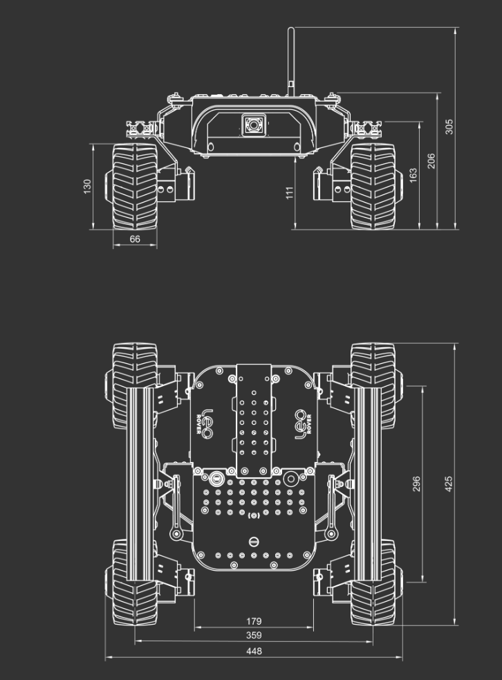

# General mechanical design draft

Weight: 6,5 kg
Dimensions: 425x448x305 mm

Maximum linear speed: ~0.4m/s
Maximum angular speed: ~60 deg/s

Estimated maximum obstacle size: 70mm
Protection rating: IP55 compliant
Run time: Estimated 4 hours of nominal driving
Connection range: Up to 100m (with live video stream)

