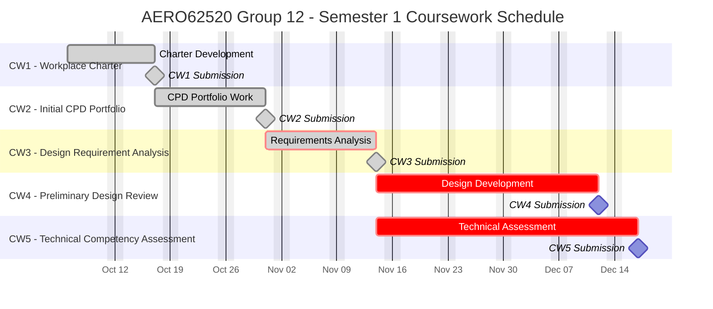
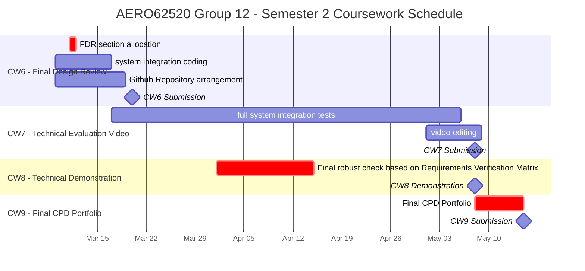

# Group12-team-space

## AERO62520 Coursework Schedule

## General goal of the project

Using the given Leo Rover and the myCobot 280pi robotic arm, build a rover that can navigate through random environment and able to pick up the coloured objects and sort them into the corresponding coloured bins in the environment.

## Git workspace structure

**Note**: all the research and analysis documents are shift to teams OneNote workspace. Gitlab is mainly used for the code and design files.

- [Mechanical_design](Mechanical_design): Mechanical design of modification for chassis and the robotic arm, and linking structures with some general draft and the design analysis.
- [Software_control](Software_control): Software control of the rover and the robotic arm, with some general glance and the software control analysis.
- [Equipment](Equipment): Equipment datasheets
- [Manipulator](Manipulator): Software control of the robotic arm, with some general glance and the software control analysis.
- [Vision](Vision): Vision related code of the rover, with some general glance and the vision system analysis.
- [CW1_workplace_charter](CW1_workplace_charter): Workplace charter of the team, with the statement of purpose and the statements of principles and commitments.
- [CW3_design_requirements_analysis](CW3_design_requirements_analysis): Design requirements analysis of the project, containing related requirements, support documents and draft of the design requirements analysis.
- [CW4_preliminary_design_review](CW4_preliminary_design_review): Preliminary design review of the project, containing the preliminary design review report and the block diagrams.

- inventory: inventory of the equipment and the parts, with the datasheets and the drawings.

## Recent Tasks

**Robot arm test**:

- ~~trying to connect to the nuc (by either hotspot or ethernet), try bypassing the need of inserting password for arm to connect to the nuc every power on.~~
- ~~test on controlling gripper to grab and release the object.~~

**Chassis navigation test**:

- ~~setup the Nav2 and slam_toolbox on nuc and able to run tb3 demo.~~
- ~~find and tested auto exploration algorithm to navigate the rover through the environment and map the environment.~~
- ~~able to connect chassis to the nuc hotspot and able to see rover topics on nuc and check the rover's state in rviz.~~

**Vision system test**:

- ~~tried YOLOv8 on NUC (without NVIDIA GPU) to detect the object and the colour of the object at 60fps.~~

**Mechanical design**:

- ~~finished designing the first version of the chassis modification to connect the other components to the chassis.~~

**system integration test**:

- adding Error handling and recovery to the system.
- adding restart or resume methods to system
- adding external stop state where the system can be stopped and the state will be saved and can be resumed later.