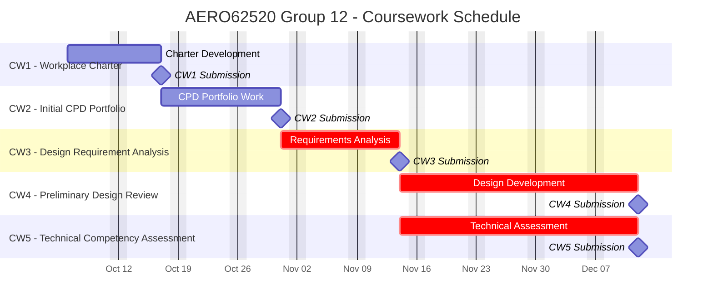

# Group12-team-space

## AERO62520 Course Timeline

```mermaid
gantt
    title AERO62520 Group 12 - Coursework Schedule
    dateFormat  YYYY-MM-DD
    axisFormat  %b %d
    excludes    weekends

    section CW1 - Workplace Charter
    Charter Development    : cw1, 2025-10-06, 9d
    CW1 Submission        : milestone, cw1_due, 2025-10-17, 0d

    section CW2 - Initial CPD Portfolio
    CPD Portfolio Work     : cw2, 2025-10-17, 10d
    CW2 Submission        : milestone, cw2_due, 2025-10-31, 0d

    section CW3 - Design Requirement Analysis
    Requirements Analysis  : crit, cw3, 2025-10-31, 10d
    CW3 Submission        : milestone, cw3_due, 2025-11-14, 0d

    section CW4 - Preliminary Design Review
    Design Development     : crit, cw4, 2025-11-14, 20d
    CW4 Submission        : milestone, cw4_due, 2025-12-12, 0d

    section CW5 - Technical Competency Assessment
    Technical Assessment   : crit, cw5, 2025-11-14, 20d
    CW5 Submission        : milestone, cw5_due, 2025-12-12, 0d
```
