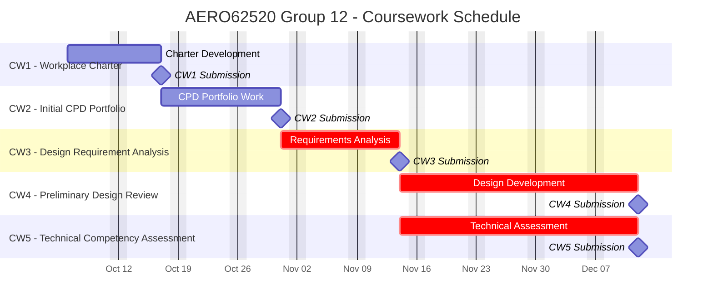

# Group12-team-space

## AERO62520 Coursework Schedule

## General goal of the project

Using the given Leo Rover and the robotic arm, build a rover that can navigate through maze and able to pick up the objects in the maze.

## Git workspace structure

- [Mechanical_design](Mechanical_design): Mechanical design of the rover and the robotic arm , with some general draft and the design requirements.
- [Software_control](Software_control): Software control of the rover and the robotic arm, with some general glance and the software control requirements.
- [CW1_workplace_charter](CW1_workplace_charter)

## Recent Tasks

**Chassis assembly** 

Problems: 

- the suspention is still loose
- the baring of one wheel is not tight enough

solved：
- missing components for connecting the wheel structure to the chassis.
- wrong port on the given Powerbox

**Remote connection with the rover(done)** 

**ROS example run(done)**

**Joystick control**

problems:

- joystick mapping yaml file is not working
(changing the first line of the yaml file to the correct mapping)

**sensor test(done)**

**NUC setup**

**robot arm test**