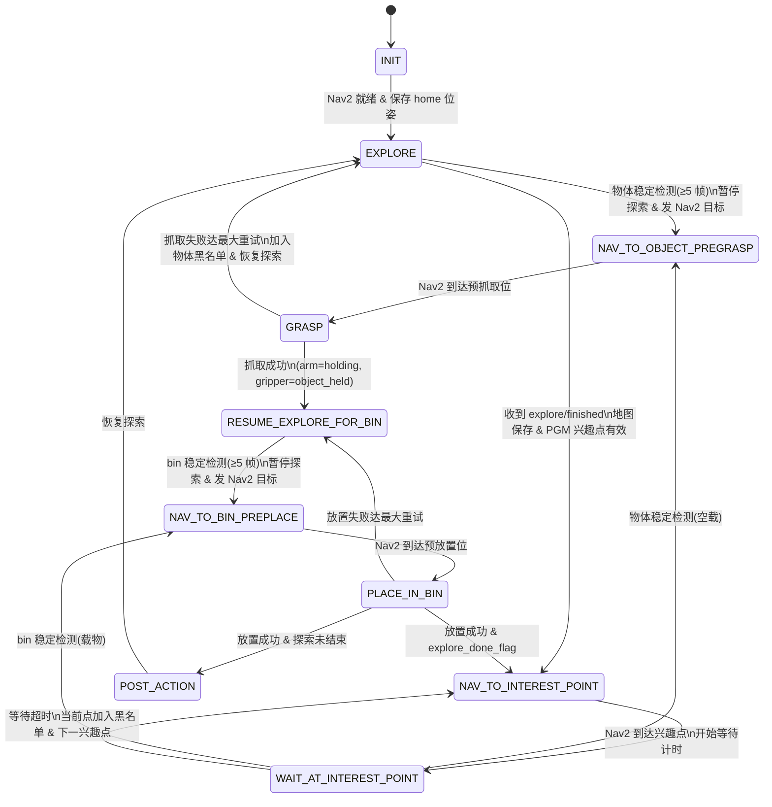
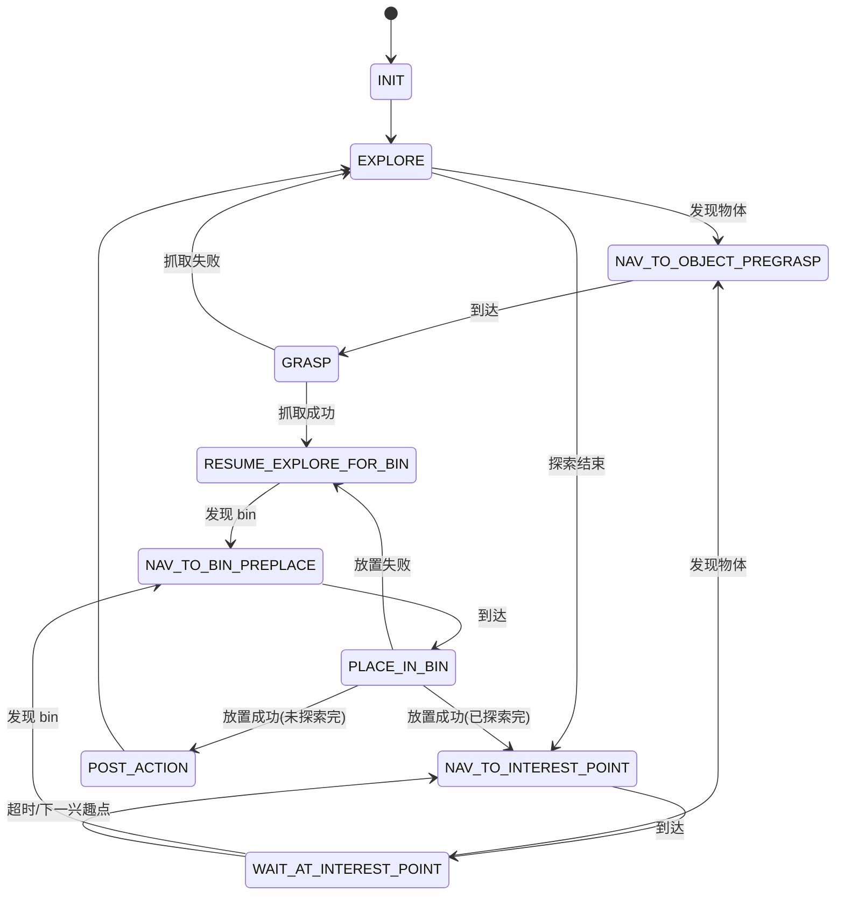
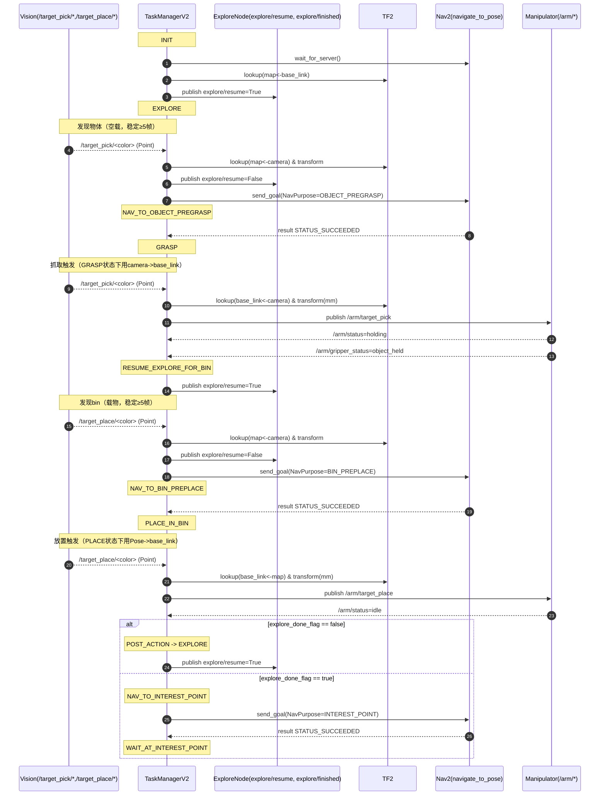

# Task Manager V2 状态机关系图

基于 `task_manager_node_v2.py` 中的 `TaskState` 与各回调/定时器逻辑整理。

## 状态说明

| 状态 | 含义 |
|------|------|
| **INIT** | 初始化，等待 Nav2 就绪并保存 home 位姿 |
| **EXPLORE** | 探索建图，可被物体/bin 检测打断 |
| **NAV_TO_OBJECT_PREGRASP** | 导航至物体预抓取位 |
| **GRASP** | 执行抓取（发 /arm/target_pick，由定时器根据 arm/gripper 状态判断结果） |
| **RESUME_EXPLORE_FOR_BIN** | 抓取成功后恢复探索以寻找 bin |
| **NAV_TO_BIN_PREPLACE** | 导航至 bin 预放置位 |
| **PLACE_IN_BIN** | 执行放置（发 /arm/target_place，由定时器根据 arm 状态判断结果） |
| **POST_ACTION** | 放置完成后、探索未结束时的收尾，随后回到 EXPLORE |
| **NAV_TO_INTEREST_POINT** | 探索结束后按兴趣点列表导航 |
| **WAIT_AT_INTEREST_POINT** | 在兴趣点等待视觉检测（物体或 bin）或超时 |

## Mermaid 状态图

## 简化版（仅状态与主线）

## 驱动来源简要

- **INIT → EXPLORE**：定时器 `_state_timer_callback` 内 `_handle_init_state()`
- **EXPLORE → NAV_TO_OBJECT_PREGRASP**：视觉话题 `_object_point_callback`（/target_pick/*）
- **NAV_TO_OBJECT_PREGRASP → GRASP**：Nav2 `nav2_result_callback`（STATUS_SUCCEEDED + OBJECT_PREGRASP）
- **GRASP → RESUME_EXPLORE_FOR_BIN / EXPLORE**：定时器内 `_handle_grasp_arm_result()`（/arm/status, /arm/gripper_status）
- **RESUME_EXPLORE_FOR_BIN → NAV_TO_BIN_PREPLACE**：视觉话题 `_bin_point_callback`（/target_place/*）
- **NAV_TO_BIN_PREPLACE → PLACE_IN_BIN**：Nav2 `nav2_result_callback`（STATUS_SUCCEEDED + BIN_PREPLACE）
- **PLACE_IN_BIN → ***：定时器内 `_handle_place_arm_result()` 或 `_nav_to_next_interest_point()` / `_handle_post_action()`
- **EXPLORE → NAV_TO_INTEREST_POINT**：话题 `_explore_finished_callback`（explore/finished）+ 地图保存与兴趣点检测
- **NAV_TO_INTEREST_POINT → WAIT_AT_INTEREST_POINT**：Nav2 `nav2_result_callback`（INTEREST_POINT）
- **WAIT_AT_INTEREST_POINT → ***：`_object_point_callback` / `_bin_point_callback` 或定时器 `_handle_wait_at_interest_point_timeout()`

