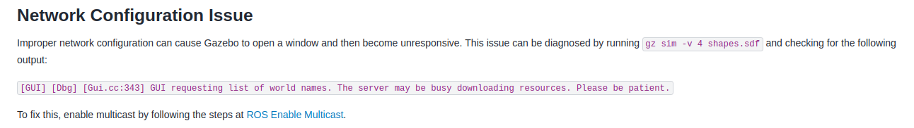

# General glance of the software control

someproblems are listed in the website: https://docs.fictionlab.pl/leo-rover/1.8/documentation/known-issues

and check following web: https://docs.fictionlab.pl/leo-rover/1.8/documentation/faq

install the robot description packsge by: 

```bash
sudo apt update
sudo apt install ros-jazzy-leo   # meta-package pulling in the common stack
# (optional, explicit packages)
sudo apt install ros-jazzy-leo-description ros-jazzy-leo-msgs ros-jazzy-leo-teleop
```

to start up the robot_description without physical robot(check availability):

```bash
ros2 run robot_state_publisher robot_state_publisher \
  --ros-args -p robot_description:="$(xacro $(ros2 pkg prefix leo_description)/share/leo_description/urdf/leo.urdf.xacro)"
```


**to view robot frame**
```bash
ros2 run tf2_tools view_frames
```

**gazebo waiting for world list problem**

https://github.com/gazebosim/gz-sim/issues/2285

after downloading gazebo, 
```
sudo apt update#
sudo apt install ros-jazzy-ros-gz
```

run these two code
```
sudo ufw allow in proto udp to 224.0.0.0/4
sudo ufw allow in proto udp from 224.0.0.0/4
```
https://gazebosim.org/docs/latest/troubleshooting/



---