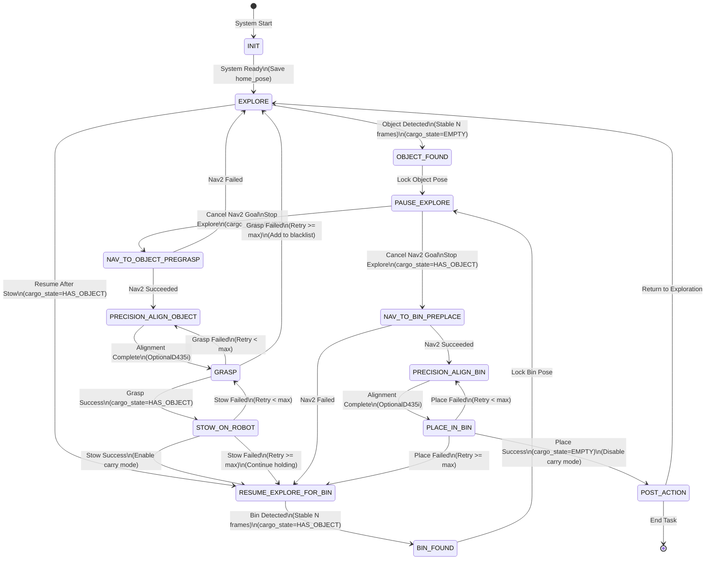

Explore–Pick–Stow–SearchBin–Place System Workflow (Desktop + D435i + MyCobot 280 Pi)

1. Objectives

Robot autonomously explores unknown environment and completes recycling tasks:

Start exploration and mapping

Discover "recyclable object" → Pause exploration → Navigate close → Precise grasping

After grasping, directly store to on-board storage position (stow pose)

Resume exploration, with "storage bin/recycling bin" as next key target

Discover bin → Pause exploration → Navigate close → Place stored object into bin

(Optional) Return to start point or continue next round after completion

2. System Modules and Responsibilities

A) Chassis Layer (Existing)

2D LiDAR → laser_filters

slam_toolbox (mapping/localization)

Nav2 (navigation)

explore_lite (frontier exploration)

B) Perception Layer (Required)

object_detector: Output object_pose (map/base_link)

bin_detector: Output bin_pose (map/base_link)

Bin is "second phase key target", must have stable detection strategy (multi-frame confirmation)

C) Manipulation Layer (Required)

grasp_server (MyCobot grasping action)

place_server (action to place object into bin)

stow_server (action to move object from grasp position to on-board storage position)

Implementation can also merge into one manipulation_server, providing GRASP / STOW / PLACE actions.

D) Task Scheduling Layer (Core)

task_manager state machine (FSM/BT)

Control explore/nav2, call detectors, call manipulation actions

3. State Machine (FSM) Recommended Version

3.0 State Flow Diagram

The following diagram illustrates the complete state machine workflow:

**State Flow Description:**

1. **Initialization Phase:**
   - `INIT` → `EXPLORE`: Wait for system ready (TF/SLAM/Nav2), save home_pose

2. **Object Pickup Phase (cargo_state=EMPTY):**
   - `EXPLORE` → `OBJECT_FOUND`: Object detected with stable confirmation (N frames)
   - `OBJECT_FOUND` → `PAUSE_EXPLORE`: Lock object pose, prepare for navigation
   - `PAUSE_EXPLORE` → `NAV_TO_OBJECT_PREGRASP`: Cancel current goal, stop exploration
   - `NAV_TO_OBJECT_PREGRASP` → `PRECISION_ALIGN_OBJECT`: Navigate to pregrasp position
   - `PRECISION_ALIGN_OBJECT` → `GRASP`: Optional precision alignment using D435i
   - `GRASP` → `STOW_ON_ROBOT`: Grasp successful, update cargo_state to HAS_OBJECT
   - `GRASP` → `EXPLORE`: Grasp failed after retries, add object to blacklist

3. **Storage Phase:**
   - `STOW_ON_ROBOT` → `RESUME_EXPLORE_FOR_BIN`: Move object to stow pose, enable carry mode

4. **Bin Search Phase (cargo_state=HAS_OBJECT):**
   - `RESUME_EXPLORE_FOR_BIN` → `BIN_FOUND`: Bin detected with stable confirmation
   - `BIN_FOUND` → `PAUSE_EXPLORE`: Lock bin pose, prepare for navigation
   - `PAUSE_EXPLORE` → `NAV_TO_BIN_PREPLACE`: Cancel current goal, stop exploration
   - `NAV_TO_BIN_PREPLACE` → `PRECISION_ALIGN_BIN`: Navigate to preplace position
   - `PRECISION_ALIGN_BIN` → `PLACE_IN_BIN`: Optional precision alignment using D435i
   - `PLACE_IN_BIN` → `POST_ACTION`: Place successful, update cargo_state to EMPTY, disable carry mode

5. **Post-Action Phase:**
   - `POST_ACTION` → `EXPLORE`: Return to exploration for next object
   - `POST_ACTION` → `[*]`: End task (optional)

**Key Features:**
- **Multi-frame confirmation**: Both object and bin detection require N consecutive frames for stability
- **Retry mechanism**: Grasp, stow, and place actions have retry logic (max 2 retries)
- **Blacklist**: Failed objects are added to blacklist to avoid repeated attempts
- **Carry mode**: Nav2 parameters are adjusted when cargo_state=HAS_OBJECT (reduce speed, increase inflation)
- **Error recovery**: Failed actions trigger appropriate recovery strategies

State List

INIT

Wait for system ready (TF/SLAM/Nav2)

Save home_pose

Initialize cargo_state = EMPTY

EXPLORE

Start/resume explore_lite

Parallel listening:

object_detector (active when cargo_state=EMPTY)

bin_detector (active when cargo_state=HAS_OBJECT)

OBJECT_FOUND

Stable object detection (e.g., continuous N frames)

Lock object (ID/position)

Enter pause exploration

PAUSE_EXPLORE

Cancel Nav2 current goal

Stop explore_lite (kill / disable / inactive)

NAV_TO_OBJECT_PREGRASP

Generate pregrasp navigation point (distance d from object, facing object)

Nav2 navigate to position

PRECISION_ALIGN_OBJECT (Optional but recommended)

Use D435i for short-range alignment (centimeter level)

Ensure arm reachable and error controllable

GRASP

Call grasp action (grasp object)

success → cargo_state=HAS_OBJECT

fail → Handle failure (retry/abandon/return to exploration)

STOW_ON_ROBOT (Key addition)

Move object to on-board storage position (stow pose)

success → Enter "search bin mode"

fail → Failure recovery (re-grasp/re-plan/abandon)

RESUME_EXPLORE_FOR_BIN

Resume explore_lite

Set "bin" as key target (switch as soon as bin detector triggers)

BIN_FOUND

Stable bin detection

Lock bin pose

PAUSE_EXPLORE (same as above)

Cancel goal + stop explore

NAV_TO_BIN_PREPLACE

Generate bin preplace navigation point (facing bin, maintain safe distance)

PRECISION_ALIGN_BIN (Recommended)

Position bin in camera center, appropriate distance

PLACE_IN_BIN

Execute placement action (take from stow position → place into bin)

success → cargo_state=EMPTY

POST_ACTION

Optional:

Return to exploration to find next object

Or return home

Or end task

4. How to Define "Store on Vehicle" (Engineering Approach for Stow Pose)

4.1 On-board Storage Position (stow pose)

You need to define a fixed and repeatable "storage pose", for example:

Within arm workspace

Not blocking LiDAR (as much as possible)

Not blocking D435i (as much as possible)

Not colliding with robot structure

Object won't fall after gripper closes

Implementation method:

Define a fixed PoseStamped stow_pose in arm_base frame (or base_link)

After successful grasp, MoveIt plans to this pose and places/maintains grip (depending on your "storage" definition)

4.2 Two Storage Options

Continuous gripper holding (simplest)

Advantages: No additional mechanism needed

Disadvantages: May drop due to walking vibration, affects navigation footprint

Place on vehicle "tray/box" (more stable)

Advantages: Reliable

Disadvantages: Requires structure/container + more complex placement action (but can still be fixed pose)

You mentioned "directly store to on-board storage bin position", I recommend the second: vehicle has a fixed "storage tray/small box".

5. "Carry Exploration" Mode (Carry mode) Required Navigation Parameter Changes

Once vehicle is loaded with object, navigation safety boundaries should change, otherwise easy to hit table corners/obstacles:

Recommend task_manager switch Nav2 parameters (or switch costmap footprint) when cargo_state=HAS_OBJECT:

Reduce max linear/angular velocity

Increase inflation radius

If object extends beyond chassis: increase footprint (simplified as "fatter robot")

This significantly reduces risk of "collision after carrying during exploration".

6. "Interrupt Exploration After Finding Bin" Similar to Pickup (How to Implement This)

Exact same mechanism:

bin_detector triggers → task_manager enters PAUSE_EXPLORE

Cancel Nav2 current goal

Stop explore_lite

Calculate bin preplace goal

Nav2 go to preplace

Close-range alignment

Execute place

That is, you just reuse "object_found flow", replace with bin_found + place action.

7. Failure and Recovery Strategies (Recommended to Add in First Version)

7.1 Object grasp failure

Retry 1–2 times (re-align / re-plan)

Exceed retries → Abandon object, return to EXPLORE (and mark object position as "blacklist point" to avoid repeated triggers)

7.2 Stow failure

Return to "grasp holding pose" and re-plan once

Still fails → Choose:

Place back on table (place back)

Or continue holding directly (temporary strategy)

7.3 Bin place failure

Insufficient bin alignment: Return to PRECISION_ALIGN_BIN

Planning failure: Slightly back up/adjust yaw and retry

Multiple failures: Resume exploration (or return home)

8. Minimum Implementation Checklist (According to This Strategy)

task_manager: Implement "pause exploration + nav2 goal" switching for two triggers (object, bin)

object_detector: At least provide stable object Pose

bin_detector: At least provide stable bin Pose

manipulation_server:

GRASP(object_pose)

STOW()

PLACE(bin_pose)

carry_mode: Adjust Nav2 parameters when HAS_OBJECT (simplified as reduce speed + inflation)