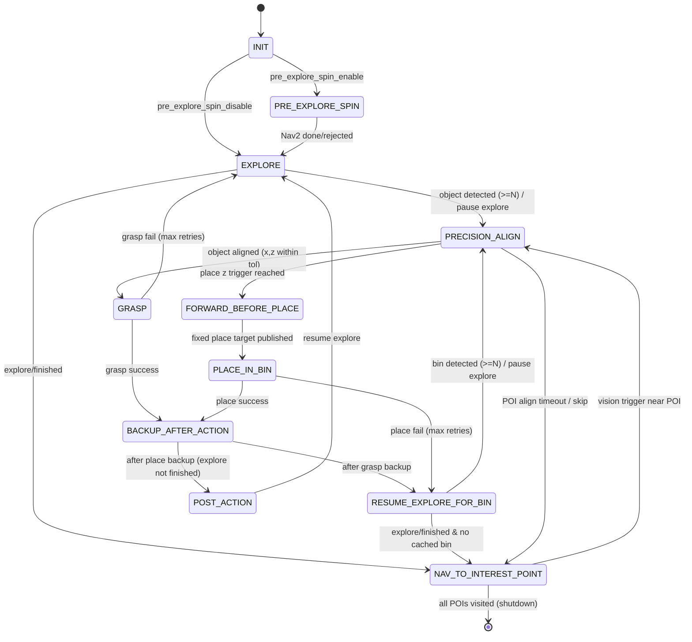

# Central Controller

## Rover bring-up: time sync and topic check

Accurate time on the base and NUC avoids TF extrapolation warnings and bad sensor fusion. After you SSH into the **rover**, open a session on the **NUC** from that shell and sync time there before running ROS 2.

### 1. SSH chain

From your laptop (example hostnames—use your team’s addresses):

```bash
ssh <user>@<rover-hostname-or-ip>
```

On the rover, SSH into the NUC:

```bash
ssh <user>@<nuc-hostname-or-ip>
```

### 2. Time sync on the NUC (command line)

On the **NUC** shell, set the NUC clock from the rover time (SSH must reach `leo-rover-12@10.0.0.2`; you may be prompted for a password unless keys are set up):

```bash
sudo date -s "$(ssh leo-rover-12@10.0.0.2 date '+%Y-%m-%d %H:%M:%S')"
```

Check with `date` or `date -u`. Exit the NUC SSH session when done if you connected via the rover; otherwise continue on the NUC for ROS commands.

### 3. Check ROS 2 topics on the NUC

With the base firmware / driver stack running, on a terminal where the NUC ROS environment is sourced, list topics:

```bash
ros2 topic list
```

You should see at least:

- `/imu/data`
- `/imu/data_raw`
- `/imu/rpy`
- `/joint_states`
- `/merged_odom`
- `/robot_description`
- `/tf`
- `/wheel_odom`

If any of these are missing, the chassis stack is probably not fully started or the wrong workspace/domain is sourced.

---

`central_controller/task_manager_node_v4.py` 是主调度节点（Task Manager V4）。它通过 **topic 驱动的状态机** 串联探索、视觉对准（纯视觉伺服）、机械臂抓取/放置，以及“探索结束后的地图兴趣点回退搜索”。

V4 的核心变化是：对准阶段不再依赖 docking action / costmap 参数切换，而是在 `PRECISION_ALIGN` 中使用 `/cmd_vel` 做 **纯视觉伺服**：

- 对 **object**：camera frame 下用 \(x\) 偏移控制角速度，用 \(z\) 与抓取目标距离 `grasp_target_camera_z_m` 的误差控制线速度；误差进入容差后 **直接进入 `GRASP`**（v2-like：达标即抓取）。
- 对 **bin**：视觉伺服到放置触发距离 `place_trigger_camera_z_m` 后，进入 `FORWARD_BEFORE_PLACE` **前进固定距离**，随后发布 **固定放置点**（`fixed_place_target_*`）并进入 `PLACE_IN_BIN`。

---

## 功能与逻辑（V4）

### 1. 初始化与探索启动

- `INIT`
  - 等待 Nav2 action server 可用；
  - 读取 TF（`map`<-`base_link`）并保存 `home_pose`。
- `PRE_EXPLORE_SPIN`（可选）
  - 若 `pre_explore_spin_enable=true`，先发送一个 Nav2 目标点：从 home pose 在 `map` 中偏移 \((dx, dy)\)，并将朝向设为 `yaw=pi`（面对 -x）。
  - 在该阶段若检测到 bin，会把 bin 的 map 坐标 **缓存**（供之后“送货”使用）。
- `EXPLORE`
  - 发布 `explore/resume=true` 启动/恢复 frontier exploration。

### 2. 视觉检测触发（object / bin）

- V4 对 object/bin 都使用“连续检测帧计数”去抑制误检，默认需要 **5 帧**（`required_detection_frames=5`）。
- **object 触发条件**
  - 仅当 `cargo_state=empty` 且当前处于 `EXPLORE`（或从兴趣点接近阶段满足触发距离）才会进入后续流程。
  - 达到阈值后：暂停探索、取消 Nav2（如有），进入 `PRECISION_ALIGN`（视觉伺服对准 object）。
- **bin 触发条件**
  - 在 `PRE_EXPLORE_SPIN/EXPLORE` 且 `cargo_state=empty` 时：只做 **缓存**（`cached_bin_poses[color]`），不进入放置流程。
  - 在 `RESUME_EXPLORE_FOR_BIN` 且 `cargo_state=has_object` 时：达到阈值后暂停探索、取消 Nav2（如有），进入 `PRECISION_ALIGN`（视觉伺服对准 bin，准备放置）。

### 3. 视觉对准（`PRECISION_ALIGN`）

- `PRECISION_ALIGN` 不直接“自发”对准；它需要新的视觉点（`/target_pick/*` 或 `/target_place/*`）作为触发，随后开始发 `/cmd_vel` 做视觉伺服控制。
- **对 object（抓取对准）**
  - 误差进入容差（`visual_docking_x_tolerance_m` 与 `grasp_target_camera_z_tolerance_m`）后直接切换到 `GRASP` 并发布 `/arm/target_pick`。
- **对 bin（放置对准）**
  - 当 camera \(z\) 进入触发容差（`place_trigger_camera_z_m` 与 `place_trigger_camera_z_tolerance`）后，切换到 `FORWARD_BEFORE_PLACE`：
    - 先停稳 `forward_before_place_stop_hold_sec`；
    - 前进 `forward_before_place_distance_m`；
    - 发布固定放置点 `/arm/target_place`（`fixed_place_target_*`）并进入 `PLACE_IN_BIN`。
- **兴趣点回退路径中的超时**
  - 若 `PRECISION_ALIGN` 的来源是 `INTEREST_POINT`，在 `wait_at_interest_point_sec` 内未等到视觉触发，则把该兴趣点加入 blacklist 并跳到下一个兴趣点。

### 4. 抓取/放置结果与后撤（`BACKUP_AFTER_ACTION`）

- `GRASP`/`PLACE_IN_BIN` 的结果由 `/arm/status` 与 `/arm/gripper_status` 判断：
  - 抓取成功：`cargo_state=has_object`，进入 `BACKUP_AFTER_ACTION`，然后进入 `RESUME_EXPLORE_FOR_BIN`（恢复探索以找 bin）。
  - 放置成功：`cargo_state=empty`，进入 `BACKUP_AFTER_ACTION`，然后进入 `POST_ACTION`（回到 `EXPLORE`）或在探索已结束时直接走兴趣点回退路径。
- `BACKUP_AFTER_ACTION` 在 V4 中固定用 `/cmd_vel` 后退 `backup_distance_m`（速度使用 `docking_linear_speed_mps`），不再尝试 Nav2 备份目标。

### 5. 探索结束后的地图回退（兴趣点）

- 当收到 `explore/finished=true`：
  - 停止探索并调用 `map_saver_cli` 保存地图；
  - 从 `.pgm` 中提取兴趣点并过滤 blacklist；
  - 进入 `NAV_TO_INTEREST_POINT`，通过 Nav2 按顺序前往兴趣点附近的 standoff 位姿（支持基于 PGM 栅格的 8 方向近障检查选择 standoff 方向）。
- 在 `NAV_TO_INTEREST_POINT` 接近目标时，如果 object 视觉再次出现且 Nav2 剩余距离小于 `interest_point_vision_trigger_distance_m`，会取消 Nav2 并切换到 `PRECISION_ALIGN` 做视觉伺服抓取。

---

## 状态转换图（V4）

下面的图覆盖主流程（探索→抓取→找箱→放置→继续探索）以及探索结束后的兴趣点回退分支。



---

## 状态概览（V4）

| State | Description |
|---|---|
| `INIT` | 等待 Nav2/TF，保存 home pose，并进入探索准备。 |
| `PRE_EXPLORE_SPIN` | 探索前的预导航（可选）：去 home 的偏移点并缓存 bin 位姿。 |
| `EXPLORE` | Frontier exploration 运行中（`explore/resume=true`）。 |
| `PRECISION_ALIGN` | 纯视觉伺服对准（object 或 bin），用 `/cmd_vel` 控制。 |
| `GRASP` | 发布 `/arm/target_pick` 并等待机械臂抓取结果。 |
| `RESUME_EXPLORE_FOR_BIN` | 抓取后恢复探索以寻找 bin（或在探索已结束时转入回退/送货逻辑）。 |
| `NAV_TO_BIN_PREPLACE` | 导航到 bin 的 standoff/preplace 位姿（当前 V4 主要走“视觉对准 bin”路径，保留该状态用于需要时的导航交接）。 |
| `FORWARD_BEFORE_PLACE` | bin 放置触发后，前进固定距离以对齐投放。 |
| `PLACE_IN_BIN` | 发布 `/arm/target_place`（固定放置点）并等待机械臂放置结果。 |
| `BACKUP_AFTER_ACTION` | 抓取/放置后用 `/cmd_vel` 后退固定距离，然后进入下一状态。 |
| `POST_ACTION` | 放置完成后的收尾状态：回到 `EXPLORE` 并恢复探索。 |
| `EXPLORE_FINISHED_FALLBACK` | 探索结束后的回退流程入口（实现上多为内部阶段）。 |
| `RUN_MAP_DETECTION` | 保存地图并提取 PGM 兴趣点（实现上多为内部阶段）。 |
| `NAV_TO_INTEREST_POINT` | 依次导航到兴趣点 standoff，并在接近时尝试视觉触发抓取/放置流程。 |

---

## 外部接口（V4）

### Topics

**Published**

- `explore/resume` (`std_msgs/Bool`)
- `task_manager/state` (`std_msgs/String`)
- `task_manager/cargo_state` (`std_msgs/String`)
- `/arm/target_pick` (`geometry_msgs/Point`)
- `/arm/target_place` (`geometry_msgs/Point`)
- `/cmd_vel` (`geometry_msgs/Twist`)

**Subscribed**

- `explore/finished` (`std_msgs/Bool`)
- `/arm/status` (`std_msgs/String`)
- `/arm/gripper_status` (`std_msgs/String`)
- `/target_pick/red|green|blue` (`geometry_msgs/Point`)
- `/target_place/red|green|blue` (`geometry_msgs/Point`)

### Services

- `task_manager/get_state` (`std_srvs/Trigger`) — returns current `state` and `cargo`.

---

## How to launch

From workspace `System_integration/Ver01_ws`:

```bash
cd /home/student21/Desktop/AERO62520_ws/personal_branch/Group12_team_space/System_integration/Ver01_ws
colcon build
source install/setup.bash
ros2 launch central_controller starter_launch
```

To build only `central_controller`:

```bash
colcon build --packages-select central_controller
source install/setup.bash
ros2 launch central_controller starter_launch
```
